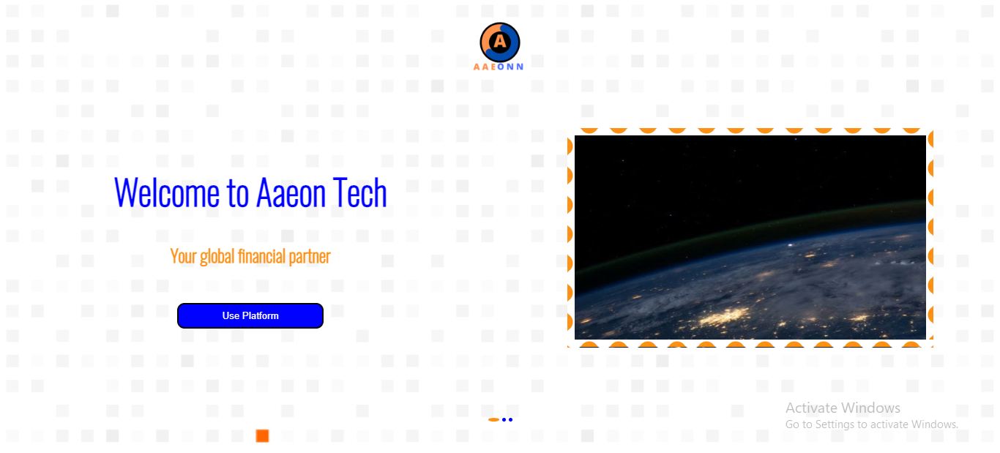

# Aaeon Tech

Introduction

This is a fintech solutions Frontend for AaeonTech built with React, Redux, Styled-components. It uses Cookie authentication, Recharts for analytics etc.

# Overview

This app does not deal with real cash as it is only meant to mirror real cash transactions. The card authentication is however very accurate as it uses the api of a known payment gateway (Paystack).

# live demo
https://aaeontech.netlify.app

Getting started 
### `npm start`

